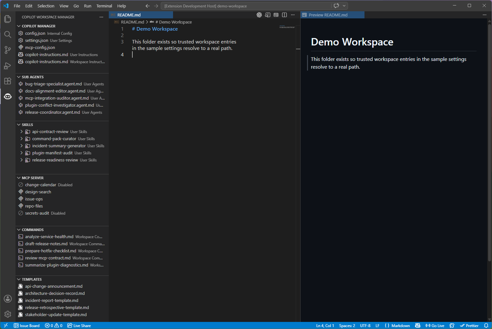
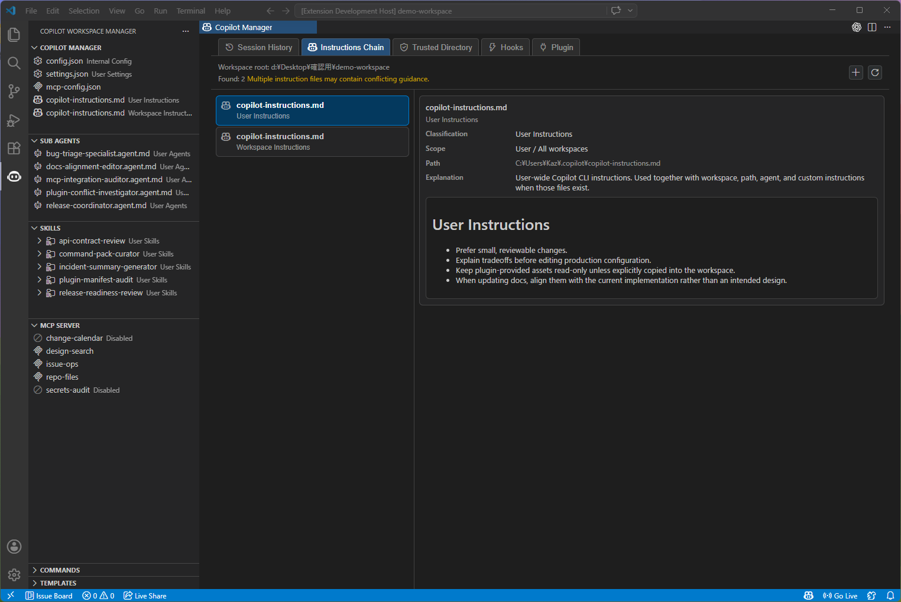
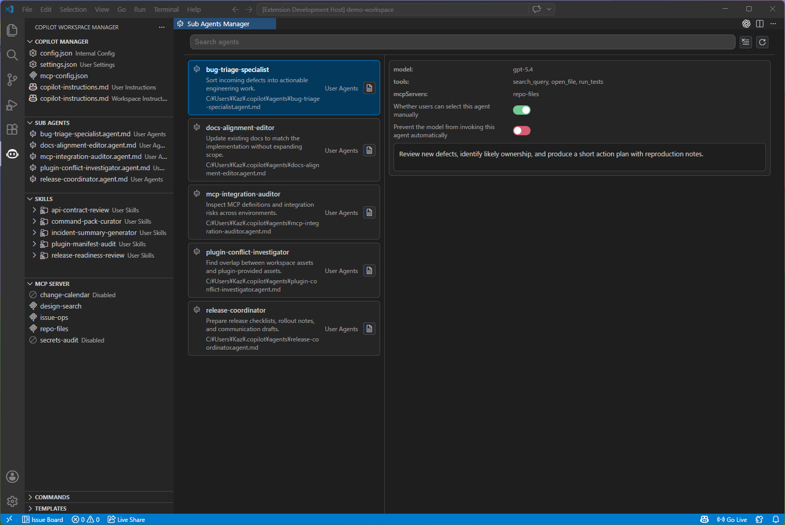
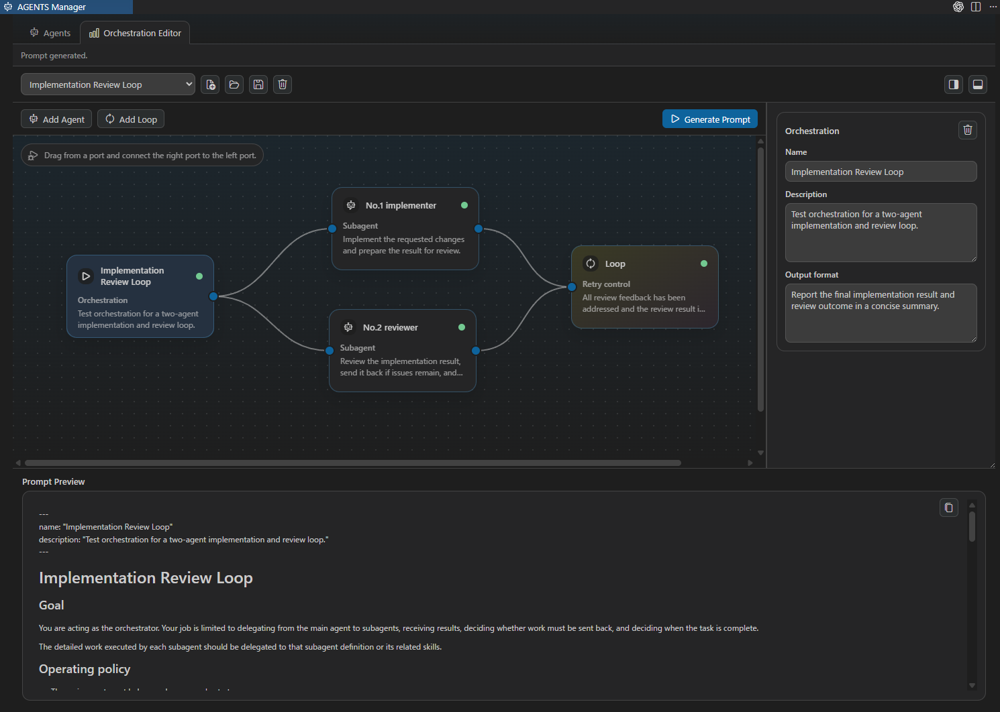
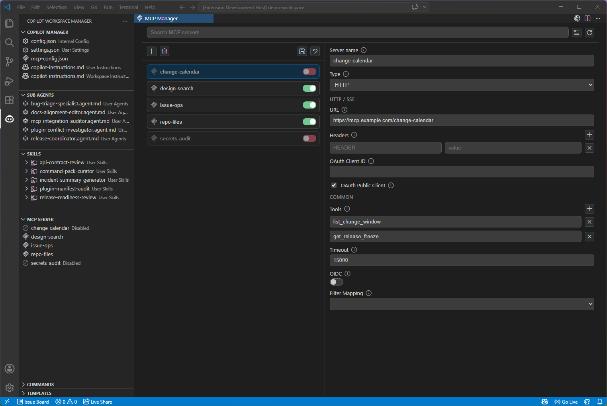

# 🧰 Copilot Workspace Manager

Copilot Workspace Manager is a VS Code extension that helps you see and manage your GitHub Copilot CLI/IDE configuration and customization assets in one place—right from your editor. It pulls together what’s often scattered across `~/.copilot`, your workspace, and installed plugins (including `config.json`, `settings.json`, `copilot-instructions.md`, Commands, Skills, Sub Agents, MCP, Templates, conversation history, Hooks, and plugin diagnostics) into a single, easy-to-follow workflow, so you can review and maintain everything without hunting things down.

## 🚀 Quick Start

1. Make sure GitHub Copilot is available and the Copilot home directory exists.  
   - By default, it uses `~/.copilot`.  
   - If `COPILOT_HOME` is set, that path takes precedence.
2. Open your workspace in VS Code.
3. Open Copilot Workspace Manager from the Activity Bar.
4. From each Explore view’s title bar, you can do the following:  
   - Add files/folders in the corresponding view  
   - Open the target folder  
   - Refresh the view  
   - Run sync from the corresponding view  
   - Open the related Manager view
5. Open Copilot Manager from the Core view or the Command Palette, and check:  
   - `History`  
   - `Instructions Chain`  
   - `Trusted`  
   - `Hooks`  
   - `Plugins`

## ✨ Key Features

- Dedicated Explore views for `Copilot Manager`, `Sub Agents`, `Skills`, `Commands`, `MCP Server`, and `Templates`
- One-click access to `config.json`, `settings.json`, `mcp-config.json`, and instruction files
- Add/rename/delete files and folders from supported views
- Skills list across Workspace / User / Plugin scopes
- Sub Agents list across Workspace / User / Plugin scopes
- Dedicated Manager views for Skills, Sub Agents, and MCP Servers
- Visual `Orchestration Editor` in `AGENTS Manager` for designing workflow / agent / loop graphs, validating them, and generating reusable prompts
- A `Copilot Manager` webview that consolidates session history, instruction diagnostics, trusted directories, hooks, and plugin diagnostics
- Read-only diagnostics for plugin-provided `Agents`, `Skills`, `Commands`, `Hooks`, `MCP Servers`, and `LSP Servers`
- Bidirectional sync for core files, Skills, Templates, and Sub Agents

## 🧭 Views

### 🧩 Copilot Manager

From the Core Explore view, you can access:

- `config.json`
- User `settings.json`
- Workspace `settings.json`
- Workspace `settings.local.json`
- `mcp-config.json`
- User/Workspace instruction files
- The `.copilot` folder
- `Copilot Manager`
- Core sync via `copilot-workspace-manager.copilotFolder`

`Copilot Manager` opens as an editor webview and currently includes the following tabs:

- `History`  
  - Reads conversation history from `~/.copilot/session-state/<session>/events.jsonl`  
  - Supports search, copy, and turn detail inspection  
  - Shows newer sessions first
- `Instructions Chain`  
  - Shows detected instruction sources  
  - Includes user instructions, workspace instructions, path instructions, workspace `AGENTS.md`, and custom instructions from `COPILOT_CUSTOM_INSTRUCTIONS_DIRS`  
  - Evaluates `applyTo` for path instructions against the active file
- `Trusted`  
  - Lists trusted folders from User/Workspace `settings.json`  
  - Supports adding and removing entries
- `Hooks`  
  - Shows workspace hooks from `.github/hooks/*.json`  
  - Shows plugin hook sources and entries
- `Plugins`  
  - Reads installed plugins from `~/.copilot/config.json`  
  - Applies enabled-state overrides from `~/.copilot/settings.json`  
  - Shows manifest path, plugin root, install kind, and component diagnostics  
  - Shows `Agents`, `Skills`, `Commands`, `Hooks`, `MCP Servers`, `LSP Servers`, and `Diagnostics`

### 🧑‍💻 Sub Agents

Manages Sub Agents from the following locations:

- Workspace Agents  
  - `<workspace>/.github/agents`  
  - `<workspace>/.claude/agents`
- User Agents  
  - `~/.copilot/agents`
- Plugin Agents  
  - Agent roots resolved from installed plugin manifests

In `Sub Agents Manager`, you can inspect frontmatter fields such as `model`, `tools`, `mcp-servers`, `user-invocable`, and `disable-model-invocation`. Plugin agents are shown as read-only.

### Orchestration Editor

`Orchestration Editor` is available from the `Orchestration` tab inside `AGENTS Manager`.

- Create and edit workflow graphs using `workflow`, `agent`, and `loop` cards on a canvas
- Configure agent order, selected subagent, delegation purpose, input, expected output, and done criteria from the Inspector
- Configure review / retry loops with `maxAttempts` and `acceptanceCriteria`
- Save workflow JSON files under `~/.codex/.codex-workspace/orchestrations`
- Validate missing required fields, invalid connections, unreachable nodes, duplicate IDs, and cycles while editing
- Generate a prompt preview from the current graph and copy it without requiring the workflow to be saved first

### 🧠 Skills

Manages Skills from multiple locations in a single Explore view:

- Workspace Skills  
  - `<workspace>/.github/skills`  
  - `<workspace>/.agents/skills`  
  - `<workspace>/.claude/skills`
- User Skills  
  - `~/.copilot/skills`  
  - `~/.agents/skills`  
  - `~/.claude/skills`
- Plugin Skills  
  - Skill roots resolved from installed plugin manifests

In `Skill Manager`, you can search, open, and toggle enabled/disabled. Skill state is managed via `disabledSkills` in `~/.copilot/settings.json`.

### 🛰️ MCP Server

Use the Explore view to browse MCP Servers, and the dedicated `MCP Manager` for detailed editing.

The Explore view consolidates:

- Enabled MCP servers from `~/.copilot/mcp-config.json`
- Disabled MCP servers from `~/.copilot/.copilot-workspace-manager/mcp-config.disabled.json`
- Read-only MCP servers from plugin manifests

`MCP Manager` supports:

- Search
- Add/edit/delete MCP server definitions
- Toggle enabled/disabled
- Edit `local`, `stdio`, `http`, and `sse` definitions
- Edit `args`, `env`, `headers`, `tools`, `timeout`, OAuth, and filter mappings

### 🧰 Commands

Manages workspace commands under `<workspace>/.claude/commands` and command roots provided by installed plugins in a single Explore view.

- Workspace commands can be edited via file actions
- Plugin commands are shown with a source label
- There is currently no dedicated Commands Manager
- There are currently no Commands-specific sync settings

### 🗂️ Templates

Manages templates under `~/.copilot/.copilot-workspace-manager/templates`.

- Supports file creation from template content
- Supports sync with `copilot-workspace-manager.templatesFolder`
- There is currently no dedicated Templates Manager

## ⌨️ Commands

| Command | Description |
| --- | --- |
| `Copilot Workspace Manager: Open Copilot Manager` | Opens the `Copilot Manager` webview |
| `Copilot Workspace Manager: Open Skill Manager` | Opens the `Skill Manager` webview |
| `Copilot Workspace Manager: Open Sub Agents Manager` | Opens the `Sub Agents Manager` webview |
| `Copilot Workspace Manager: Open MCP Manager` | Opens the `MCP Manager` webview |
| `Copilot Workspace Manager: Open .copilot Folder` | Opens the `.copilot` folder in your OS file manager |
| `Copilot Workspace Manager: Open Agents Folder` | Opens the agents folder based on the current selection or workspace context |
| `Copilot Workspace Manager: Refresh` | Refreshes the corresponding Explore view |
| `Copilot Workspace Manager: Sync` | Runs sync from the title bar when a folder sync setting is configured |

## ⚙️ Settings

| Key | Type | Default | Description |
| --- | --- | --- | --- |
| `copilot-workspace-manager.copilotFolder` | string | `""` | Sync destination for `~/.copilot/config.json`, `~/.copilot/settings.json`, `~/.copilot/mcp-config.json`, `~/.copilot/copilot-instructions.md`, and the disabled MCP config under `.copilot-workspace-manager` |
| `copilot-workspace-manager.skillsFolder` | string | `""` | Sync destination for `~/.copilot/skills` |
| `copilot-workspace-manager.templatesFolder` | string | `""` | Sync destination for `~/.copilot/.copilot-workspace-manager/templates` |
| `copilot-workspace-manager.agentFolder` | string | `""` | Sync destination for `~/.copilot/agents` |
| `copilot-workspace-manager.maxSessionHistoryCount` | number | `100` | Maximum number of sessions shown in Session History (newest first) |

## 📄 License

MIT
