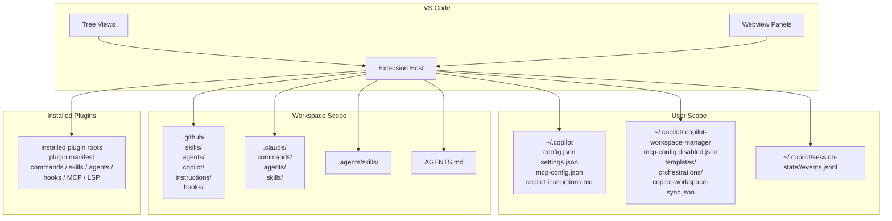

# 📘 Copilot Workspace Manager 設計書

## 1. 🏷️ システム概要

- **アプリ名**: `Copilot Workspace Manager`
- **目的**: GitHub Copilot CLI / IDE の設定ファイル、instructions、commands、skills、agents、MCP、plugin 情報を VS Code 内で一元的に確認・編集する
- **対象ユーザー**: `~/.copilot` と workspace 配下の Copilot 関連ファイルを日常的に扱う開発者
- **設計方針**:
  - コードベースを唯一の真実とし、Workspace / User / Plugin の実体パスをそのまま見せる
  - Tree View は「一覧と導線」、Manager View は「詳細閲覧または編集」に責務を分ける
  - plugin 由来要素は readonly を既定とし、競合は diagnostics として表示する
  - Agent Manager 内の Orchestration Editor で、workflow 定義 JSON と prompt 生成を完結させる

## 2. 🧰 技術スタック

| 階層 | 技術・ライブラリ |
| --- | --- |
| 言語 | TypeScript |
| 実行基盤 | Node.js |
| 拡張 API | VS Code Extension API |
| Webview | `WebviewPanel` |
| 設定形式 | JSON / Markdown frontmatter |
| 多言語対応 | `vscode-nls` ベースの i18n |
| アイコン | `ThemeIcon` + bundled codicons / images |
| テスト | Mocha + VS Code Test |
| バンドル | `esbuild` |

## 3. 🗂️ プロジェクト構造

```txt
copilot-workspace-manager/
├── src/
│   ├── extension.ts
│   ├── commands/
│   │   ├── agentCommands.ts
│   │   └── fileCommands.ts
│   ├── models/
│   ├── services/
│   │   ├── workspaceStatus.ts
│   │   ├── historyService.ts
│   │   ├── historyPanel.ts
│   │   ├── historyPanelState.ts
│   │   ├── coreDiagnosticsService.ts
│   │   ├── coreManagerConfigService.ts
│   │   ├── pluginConfigService.ts
│   │   ├── pluginDiagnosticsService.ts
│   │   ├── skillLocations.ts
│   │   ├── skillConfigService.ts
│   │   ├── skillManagerPanel.ts
│   │   ├── agentLocations.ts
│   │   ├── agentManagerService.ts
│   │   ├── agentManagerPanel.ts
│   │   ├── mcpService.ts
│   │   ├── mcpManagerService.ts
│   │   ├── mcpManagerPanel.ts
│   │   ├── syncService.ts
│   │   ├── templateService.ts
│   │   └── settings.ts
│   ├── views/
│   │   ├── coreExplorerProvider.ts
│   │   ├── fileExplorerProvider.ts
│   │   ├── agentExplorerProvider.ts
│   │   └── mcpExplorerProvider.ts
│   └── test/
├── images/
├── docs/
└── package.json
```

## 4. 🧩 機能設計

### 4.1 エントリポイントとビュー登録

- `extension.ts` が次の Tree View を生成する。
  - `copilot-workspace-manager.core`
  - `copilot-workspace-manager.prompts`
  - `copilot-workspace-manager.skills`
  - `copilot-workspace-manager.templates`
  - `copilot-workspace-manager.mcp`
  - `copilot-workspace-manager.agents`
- `extension.ts` が次の WebviewPanel 管理クラスを初期化する。
- `HistoryPanelManager` (`Core View`)
  - `SkillManagerPanelManager`
  - `AgentManagerPanelManager`
  - `McpManagerPanelManager`
- 各 View / Panel は `refresh` や selection tracking、expansion tracking と接続される。
- `AgentManagerPanelManager` は agent detail に加えて orchestration tab の状態配信も担う。

### 4.2 パス解決と availability

- `resolveCopilotPaths()` は `COPILOT_HOME` があればそれを優先し、なければ `~/.copilot` を使う。
- 返却する主要パスは次のとおり。
  - `configPath = ~/.copilot/config.json`
  - `mcpConfigPath = ~/.copilot/mcp-config.json`
  - `managerDir = ~/.copilot/.copilot-workspace-manager`
  - `mcpDisabledConfigPath = ~/.copilot/.copilot-workspace-manager/mcp-config.disabled.json`
- `getWorkspaceStatus()` と `getCoreWorkspaceStatus()` は現実装では常に `isAvailable: true` を返す。
- 実際の `config.json` 存在・読み取り・JSON 妥当性は `getCopilotConfigStatus()` が別途判定し、Core Explorer 上の warning 表示に使う。

### 4.3 Core Explorer

- `CoreExplorerProvider` は存在する項目だけを列挙する。
- 表示候補は次の順序で定義される。
  1. `config.json`
  2. user `settings.json`
  3. workspace `settings.json`
  4. workspace `settings.local.json`
  5. `mcp-config.json`
  6. instruction files (`copilot-instructions.md`、`*.instructions.md`、`AGENTS.md`、custom AGENTS)
- workspace instructions 群は内部的には `buildAgentsLoadingChain()` の結果から構成するが、UI 上の名称は `Instructions Chain` である。
- Core Explorer は「存在するファイルへの導線」であり、設定更新は Core View や各 Manager 側へ分離されている。

### 4.4 Commands View

- 内部 ID は `copilot-workspace-manager.prompts` のままだが、ユーザー向け表示名は `Commands` である。
- `FileExplorerProvider('commands')` を使う。
- root 候補は次のとおり。
  - workspace commands: `<workspace>/.claude/commands`
  - workspace prompts: `<workspace>/.github/prompts`
  - plugin commands: installed plugin が提供する command roots
- `Commands` View は user prompts を持たないが、workspace prompt files として `.github/prompts` を含む。
- 表示順は root 単位で組み立て、配下はファイルツリーとして列挙する。
- ファイル操作は `fileCommands.ts` 経由で行う。
- `addPromptsFile` は commands root 選択時に保存先 QuickPick を開き、`.github/prompts` 側へ作成する場合は `applyPromptFileExtension()` で `*.prompt.md` を強制する。
- 一覧の description は path ではなく種別ラベルのみを表示し、workspace 配下は `Workspace Command`、plugin 配下は `Plugin Commands` を使う。

### 4.5 Skills Explorer と Skill Manager

- Skills root は `getSkillLocations()` で決定する。
- project roots:
  - `<workspace>/.github/skills`
  - `<workspace>/.agents/skills`
  - `<workspace>/.claude/skills`
- user roots:
  - `~/.copilot/skills`
  - `~/.agents/skills`
  - `~/.claude/skills`
- plugin roots:
  - installed plugin manifest から解決した skill roots
- `listSkillRecords()` は各 root 配下の `SKILL.md` を列挙し、frontmatter の `name` / `description` を読む。
- enabled 状態は `settings.json.disabledSkills` による否定リスト方式で保持する。
- `SkillManagerPanelManager` は `resolveCopilotPaths().configPath` を起点に skill records を読み、一覧・検索・toggle・open を提供する。
- Skill Manager は path と location label を常に表示し、どのスコープから来た skill かを明確化する。

### 4.6 Agents Explorer と Agent Manager

- Agents root は `getAgentLocations()` で決定する。
- project roots:
  - `<workspace>/.github/agents`
  - `<workspace>/.claude/agents`
- user root:
  - `~/.copilot/agents`
- plugin roots:
  - installed plugin manifest から解決した agent roots
- `listAgentManagerRecords()` は `*.agent.md` と plugin 側 markdown agents を読み、frontmatter の次項目を抽出する。
  - `name`
  - `description`
  - `model`
  - `tools`
  - `mcp-servers`
  - `user-invocable`
  - `disable-model-invocation`
- plugin agents は `readonly: true` となり、Agent Manager では lock 表示を行う。
- `setAgentFrontmatterToggle()` は `user-invocable` / `disable-model-invocation` の frontmatter を直接更新する。
- Explorer の enable / disable コマンドは UI 上残るが、実体は `frontmatterManaged` メッセージ表示のみで、エージェントの有効状態を永続化しない。
- `AgentManagerPanelManager` の Webview は `Agents` タブと `Orchestration Editor` タブを持つ。

#### 4.6.1 Orchestration Editor

- orchestration の永続化は `orchestrationService.ts` が担う。
- 保存先ディレクトリは `getOrchestrationDirectory()` で解決し、実体は `~/.copilot/.copilot-workspace-manager/orchestrations` である。
- workflow モデルは `OrchestrationWorkflow` で、`version`、`workflowId`、`name`、`description`、`finalOutputFormat`、`nodes`、`edges`、`createdAt`、`updatedAt` を持つ。
- node 種別は `workflow`、`agent`、`loop` の 3 つである。
- `saveWorkflowDefinition()`、`loadWorkflowDefinition()`、`deleteWorkflowDefinition()`、`listSavedWorkflowSummaries()` が JSON ファイル入出力を提供する。
- `validateWorkflowDefinition()` は workflow 名、card 構成、agent order、loop 接続、到達可能性、cycle などを検証し、`errors` と `warnings` を返す。
- `generateWorkflowPrompt()` は validation 結果を前提に、workflow 定義から日本語または英語の prompt Markdown を生成する。
- Agent Manager Webview は `createWorkflow`、`saveWorkflow`、`loadWorkflow`、`deleteWorkflow`、`validateWorkflow`、`generatePrompt`、`copyPrompt`、`openWorkflowFolder` の message を送信し、拡張側が処理結果を `workflowCatalog`、`workflowLoaded`、`workflowSaved`、`workflowDeleted`、`workflowValidation`、`workflowPrompt` で返す。
- 旧形式 output node を含む workflow JSON は `loadWorkflowDefinition()` の正規化時に `finalOutputFormat` へ移行される。

### 4.7 MCP Explorer と MCP Manager

- `readMcpServers()` は次の 3 系統を統合する。
  - `mcp-config.json` の enabled 定義
  - `mcp-config.disabled.json` の disabled 定義
  - plugin manifest 由来の readonly MCP 定義
- 通常 MCP は enabled/disabled を別ファイルに分けて保持する。
- plugin MCP は `sourceLabel = "Plugin MCP"` を持つ readonly 定義として末尾に付加する。
- `McpExplorerProvider` は一覧側のみを担当し、enabled 状態と source label を description/icon に反映する。
- `McpManagerPanelManager` は `listMcpFormModels()` を用いて詳細フォーム用モデルを構築する。
- フォームは `type` に応じて local / remote セクションを切り替え、次項目を編集する。
  - 基本: `id`, `type`
  - local / stdio: `command`, `args`, `cwd`
  - http / sse: `url`
  - 共通補助: `env`, `headers`, `tools`, `timeout`, `oauthClientId`, `oauthPublicClient`, `oidc`, `filterMapping`
- toggle は `toggleMcpServer()` で enabled / disabled ファイル間を移送する。

### 4.8 Templates Explorer

- `templateService.ts` と `FileExplorerProvider('templates')` が `~/.copilot/.copilot-workspace-manager/templates` を扱う。
- Templates は plugin や workspace の複数 root を持たない。
- Templates 同期もこの 1 root のみを対象にする。

### 4.9 Core View

#### 4.9.1 History

- `historyService.ts` が `resolveSessionsRoot()` で `~/.copilot/session-state` を解決する。
- 各 session ディレクトリ配下の `events.jsonl` を読み、turns を抽出する。
- `HistoryPanelManager` は一覧検索、turn selection、copy、tab refresh を担当する。
- `historyPanelState.ts` の `deriveHistoryPanelViewModel()` が一覧・選択状態の派生を行う。

#### 4.9.2 Instructions Chain

- `buildAgentsLoadingChain()` が instruction files を集約する。
- 対象ソースは user instructions、workspace instructions、path instructions、workspace `AGENTS.md`、custom instruction dirs の `AGENTS.md` である。
- path instructions は `applyTo` と現在アクティブなファイルパスを突き合わせる。

#### 4.9.3 Trusted

- `listTrustedDirectories()` は user / workspace の `settings.json` を読む。
- Trusted 一覧は source label と path を持つ。
- add / remove は `coreDiagnosticsService.ts` が settings JSON を更新する。

#### 4.9.4 Hooks

- `listHookDiagnostics()` は workspace hooks と plugin hooks を読む。
- workspace hooks は `<workspace>/.github/hooks/*.json`
- plugin hooks は installed plugin 配下 `hooks.json`
- source と entry を分離し、左 list / 右 details の構成で表示する。

#### 4.9.5 Plugins

- `listPluginDiagnostics()` は plugin metadata と component diagnostics を返す。
- installed plugin の一次情報は `config.json.installedPlugins`
- enabled override は `settings.json.enabledPlugins`
- manifest 探索順は `.plugin/plugin.json` → `plugin.json` → `.github/plugin/plugin.json` → `.claude-plugin/plugin.json`
- diagnostics では少なくとも次の観点を扱う。
  - manifest 欠落
  - name 欠落
  - direct install
  - readonly components
  - agent / skill / MCP の conflict / overridden
  - secret-like object を持つ定義

### 4.10 コマンドと同期

- `openCoreManager`、`openSkillManager`、`openAgentManager`、`openMcpManager` が各 WebviewPanel を開く。
- sync commands は `syncCore`、`syncSkills`、`syncTemplates`、`syncAgents` の 4 つのみ。
- `syncCoreFilesBidirectional()` は次の固定ファイル集合を同期する。
  - `config.json`
  - `settings.json`
  - `mcp-config.json`
  - `copilot-instructions.md`
  - `.copilot-workspace-manager/mcp-config.disabled.json`
- 汎用同期は `syncDirectoryBidirectional()` を用い、削除判定状態は `copilot-workspace-sync.json` に保持する。

## 5. 🗃️ データモデル

| エンティティ | 主属性 | 説明 |
| --- | --- | --- |
| `WorkspacePaths` | `copilotDir`, `configPath`, `managerDir`, `mcpConfigPath`, `mcpDisabledConfigPath` | Copilot 関連の基準パス |
| `SkillLocation` | `kind`, `label`, `rootPath`, `createPath`, `priority` | skill roots の一覧 |
| `SkillRecord` | `id`, `name`, `description`, `skillPath`, `location`, `enabled` | Skill Manager の表示モデル |
| `AgentLocation` | `kind`, `label`, `rootPath`, `createPath`, `priority` | agent roots の一覧 |
| `AgentManagerRecord` | `name`, `description`, `model`, `tools`, `mcpServers`, `userInvocable`, `disableModelInvocation`, `agentPath`, `readonly` | Agent Manager の表示モデル |
| `OrchestrationWorkflow` | `version`, `workflowId`, `name`, `description`, `finalOutputFormat`, `nodes`, `edges`, `createdAt`, `updatedAt` | Orchestration Editor の保存モデル |
| `OrchestrationWorkflowSummary` | `workflowId`, `name`, `description`, `updatedAt` | Orchestration 一覧表示用の軽量モデル |
| `WorkflowValidationResult` | `errors`, `warnings` | workflow validation 結果 |
| `McpServer` | `id`, `entryId`, `enabled`, `readOnly`, `sourceLabel` | Explorer 用 MCP モデル |
| `McpFormModel` | `id`, `type`, `command`, `args`, `cwd`, `url`, `env`, `headers`, `tools`, `timeout`, `oauthClientId`, `oauthPublicClient`, `oidc`, `filterMapping`, `enabled`, `readOnly`, `sourceLabel` | MCP Manager の編集モデル |
| `PluginRecord` | `pluginSpec`, `name`, `state`, `installKind`, `pluginRoot`, `manifestPath`, `agents`, `skills`, `commands`, `hooks`, `mcpServers`, `lspServers`, `diagnostics` | Plugins タブの統合モデル |
| `HistoryTurnRecord` | `turnId`, `sessionId`, `userMessage`, `assistantMessages`, `toolUsages`, `issues`, `rawEvents` | History タブの表示単位 |
| `AgentsChainNode` | `kind`, `status`, `fileName`, `absolutePath`, `contentPreview`, `applyTo` | Instructions Chain の表示単位 |
| `HookSourceRecord` | `id`, `kind`, `label`, `path`, `entryCount` | Hooks タブの左リスト |
| `HookEntryRecord` | `sourceId`, `event`, `matcher`, `command`, `schema`, `timeout`, `statusMessage` | Hooks タブの詳細レコード |

## 6. 🖥️ 画面設計

- **View Container**
  - `Core`
  - `Agents`
  - `Skills`
  - `Commands`
  - `MCP`
  - `Templates`
- **Core Explorer**
  - 設定ファイルと instruction files を単一 list で表示
  - `config.json` 不正時は warning icon / description を付加
- **Commands View**
  - `.claude/commands`、`.github/prompts`、Plugin Commands を単一ビューで表示
  - 一覧には `Workspace Command` / `Plugin Commands` の種別ラベルを表示
- **Skills Explorer**
  - root folder と `SKILL.md` を中心に表示
  - location label で Workspace / User / Plugin の違いを見せる
- **Agents Explorer**
  - flat list で agent files を表示
  - plugin items は readonly context として扱う
- **MCP Explorer**
  - enabled / disabled / plugin MCP を単一 list に並べる
  - disabled は `circle-slash`、enabled は `mcp`
- **Skill Manager**
  - 上部検索 + refresh
  - 一覧カードに name、description、path、location、enabled switch、open
- **Agent Manager**
  - 左 list / 右 detail
  - detail には model、tools、mcpServers、frontmatter toggles、preview を表示
  - 追加で `Orchestration Editor` タブを持ち、canvas、inspector、saved workflow selector、prompt preview を表示
- **MCP Manager**
  - 左 list / 右 form
  - list に source label、enabled 状態、readonly 状態を表示
  - form に type 別フィールドを表示
- **Core View**
  - タブ: `History` / `Instructions Chain` / `Trusted` / `Hooks` / `Plugins`
  - `Plugins` は component block 単位の折りたたみ表示
  - `Hooks` は左 source / 右 entry details

## 7. 🗺️ システム構成図



## 8. 🔌 外部インターフェース

- **ローカルファイルシステム**
  - `~/.copilot`
  - `~/.copilot/.copilot-workspace-manager`
  - workspace 配下 `.github` / `.claude` / `.agents`
- **VS Code Extension API**
  - `TreeView`
  - `commands`
  - `window.showInformationMessage`
  - `window.showWarningMessage`
  - `WebviewPanel`
- **環境変数**
  - `COPILOT_HOME`
  - `COPILOT_CUSTOM_INSTRUCTIONS_DIRS`
- **JSON frontmatter / plugin manifest**
  - installed plugin manifest の探索順と component keys に依存する

## 9. 🧪 テスト戦略

- `workspaceStatus`:
  - `config.json` の存在 / 読み取り / JSON 妥当性
- `fileExplorerProvider`:
  - prompts / skills / templates roots の解決
  - plugin commands / plugin skills の表示
- `agentLocations` / `skillLocations`:
  - Workspace / User / Plugin roots の優先順
- `skillConfigService`:
  - `disabledSkills` による enabled 状態
- `agentManagerService`:
  - frontmatter 読み取り
  - `user-invocable` / `disable-model-invocation` 更新
- `mcpService` / `mcpManagerService`:
  - enabled / disabled ファイル分離
  - plugin MCP の readonly 追加
  - MCP form model 構築
- `pluginDiagnosticsService`:
  - manifest 探索
  - component diagnostics
  - `enabledPlugins` override
- `historyService` / `historyPanel`:
  - `session-state` 読み取り
  - ターン抽出
  - 検索と最大件数
