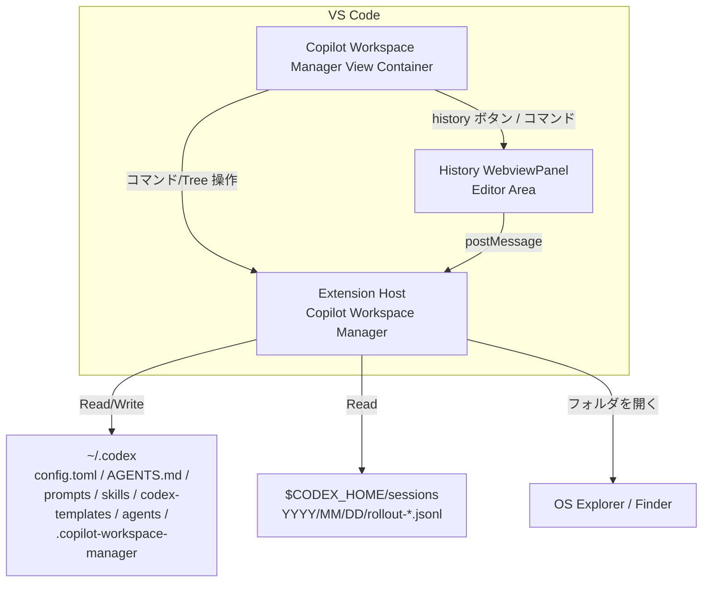

# 📘Copilot Workspace Manager 計書書

## 1. 🏷️システム概要

- **アプリ名**：`Copilot Workspace Manager`
- **目的**：Codex の `~/.codex` 配下にある設定・プロンプト・スキル・テンプレート・エージェント・MCP 設定を VS Code 内で一元的に閲覧・編集できるようにする
- **対象ユーザー**：`~/.codex` の設定や各種ファイルを日常的に編集する Codex 利用者

## 2. 🧰技術スタック

| 階層 | 技術・ライブラリ |
| --- | --- |
| 言語 | TypeScript |
| 実行基盤 | Node.js |
| 拡張API | VS Code Extension API |
| 履歴ビューUI | WebviewPanel（エディタ領域） |
| 設定パース | TOML パーサ（例：`toml`） |
| 多言語対応 | `vscode-nls` |
| アイコン | `@vscode/codicons` |
| テスト | Mocha + VS Code Test（`@vscode/test-*`） |

## 3. 🗂️プロジェクト構造

```txt
copilot-workspace-manager/
├── src/
│   ├── extension.ts           # エントリポイント
│   ├── views/                 # 各 Explorer の TreeDataProvider
│   ├── services/              # ファイル操作・MCP/Agent 切替・利用可否判定
│   │   ├── historyService.ts  # 会話履歴の走査・抽出・インデックス化
│   │   ├── historyPanel.ts    # 履歴 WebView UI とメッセージング
│   │   ├── coreDiagnosticsService.ts # AGENTS Loading Chain / trusted directory 診断
│   │   ├── coreManagerConfigService.ts # feature flags / hooks 診断と設定更新
│   │   ├── configTomlOrganizerService.ts # config.toml 整理とバックアップ
│   │   ├── settings.ts        # 設定値読み取り（同期先/履歴設定）
│   │   ├── agentService.ts    # Agent 追加/編集/削除と有効化/無効化
│   │   └── syncStateService.ts # 同期メタの読取/移行（.copilot-workspace-manager）
│   ├── models/                # データモデル（TreeItem/MCP 等）
│   └── i18n/                  # 日本語/英語メッセージ定義
├── images/                    # アイコン類
├── docs/
└── package.json
```

## 4.🧩機能設計

- **共通（利用可否判定）**
  - 入力：`~/.codex` と `config.toml` の存在、`config.toml` の読み取り結果
  - 処理：存在チェックと TOML パース
  - 出力：利用可否ステータス、不可時は理由表示（`⚠ Copilot Workspace Manager を開けません: <理由>`）
  - 補足：`config.toml` の parse 失敗時は全面停止ではなく、Core ファイルの Open、会話履歴、AGENTS Loading Chain、Hooks source 導線を残し、設定更新系のみ無効化する
  - 検索条件：なし
  - ソート：なし
  - バリデーション：設定更新系を有効化するには `config.toml` が TOML として parse 可能であること

- **共通（対象選択必須）**
  - 入力：Tree 上の選択状態
  - 処理：対象未選択なら処理を中断
  - 出力：`showInformationMessage("操作する対象を選択してください。")`（英語環境では英語）
  - 検索条件：なし
  - ソート：なし
  - バリデーション：対象選択の有無

- **Prompts / Skills / Templates Explorer（閲覧・追加・編集・削除・リネーム）**
  - 入力：対象選択、入力名、（テンプレート適用時は）テンプレート選択
  - 処理：ルートフォルダ自動作成、ファイル/フォルダ作成、編集はファイルのみ、削除時は確認、リネーム規則適用
  - 出力：Tree 更新、ファイルはエディタで開く
  - 検索条件：なし
  - ソート：フォルダ → ファイル、名称昇順（大文字小文字無視・数値考慮）
  - バリデーション：
    - ルートフォルダ（`prompts/skills/codex-templates`）はリネーム不可
    - 禁止文字は `_` に置換
    - 拡張子なしは `.md` を付与
    - 命名重複時（ファイル）は連番候補を提示し、OK で連番名を採用・キャンセルで中止
    - 命名重複時（フォルダ）はエラー表示で中止
    - 大文字小文字のみの変更は許可

- **テンプレート機能**
  - 入力：テンプレート選択（`.codex/codex-templates` 配下のファイルのみ）
  - 処理：テンプレート内容を新規作成ファイルへ適用
  - 出力：テンプレ内容の反映済みファイル
  - 検索条件：隠しファイル（`.` 始まり）は除外
  - ソート：VS Code 標準の表示順
  - バリデーション：テンプレートフォルダは固定（`.codex/codex-templates`）、自動移動/自動削除/マイグレーションは行わない

- **Agent Explorer（一覧・追加・編集・削除・有効/無効）**
  - 入力：対象選択、エージェント名、説明、テンプレート選択、コンテキストメニュー操作
  - 処理：
    - `.codex/agents` 配下の `*.toml` を一覧表示し、選択時にエディタで開く
    - 追加時は名前/説明/テンプレート選択のウィザードを実行し、`.codex/agents/<agent>.toml` を作成
    - 追加成功後に `config.toml` へ `[agents.<agent>]` を自動追記（重複時は上書きしない）
    - 無効化時は `[agents.<agent>]` を削除し、削除ブロックを `.codex/.copilot-workspace-manager/agents-disabled.json` に退避
    - 有効化時は退避ブロックを復元し、退避がなければ最小構成ブロックを追加
    - 有効化/無効化操作はインラインアイコン（`agent_on.png` / `agent_off.png`）で提供する
  - 出力：Tree 更新、`config.toml` 更新、再起動案内通知
  - 検索条件：`*.toml` のみ
  - ソート：フォルダ → ファイル、名称昇順
  - バリデーション：`.codex/agents/<agent>.toml` 重複時は作成中断、固定ルート `agents` はリネーム不可

- **MCP Explorer（一覧・トグル）**
  - 入力：`config.toml` の `[mcp_servers.<id>]` 定義、クリック操作
  - 処理：出現順で一覧化、`enabled` の反転、必要時は `enabled = false` をヘッダ直下へ挿入
  - 出力：スイッチ風表示の更新、完了通知
  - 検索条件：なし
  - ソート：`config.toml` の出現順
  - バリデーション：`enabled` 行はスペース有無を許容、末尾コメントは保持

- **フォルダを開く**
  - 入力：ビューごとの「フォルダを開く」コマンド実行
  - 処理：Prompts/Skills/Templates/Agents は各ルートフォルダ、Core は `.codex` を OS の Explorer/Finder で開く
  - 出力：OS 側のフォルダ表示
  - 検索条件：なし
  - ソート：なし
  - バリデーション：対象パスの存在

- **同期（Sync）**
  - 入力：同期先フォルダ設定、同期ボタン押下
  - 処理：確認メッセージ表示後、OK の場合に相互同期を実行
    - Core：`.codex/AGENTS.md` と `.codex/config.toml`
    - Prompts：`.codex/prompts` 配下のファイル
    - Skills：`.codex/skills` 配下のファイル
    - Templates：`.codex/codex-templates` 配下のファイル
    - Agents：`.codex/agents` 配下のファイル
    - 同名ファイルは最終更新日時が新しい方を正として古い方を上書きする
    - いずれかで削除されたファイルは両方から削除する
    - 削除同期の判定に必要なメタ情報は `.codex/.copilot-workspace-manager/codex-sync.json` に保存し、削除が両方に反映された時点で対象エントリを削除する
    - 読取優先順は `.codex/.copilot-workspace-manager/codex-sync.json` → `.codex/.codex-sync/state.json`
    - 新メタが存在せず旧メタが存在する場合、テンポラリファイル経由で新メタへ原子的に移行し、成功時のみ旧メタを削除する
    - `.codex/.copilot-workspace-manager` 配下は隠しフォルダとして同期対象外
    - 隠しフォルダ/隠しファイルは対象外
    - 上書き中にエラーが発生した場合は該当ファイルのみスキップし、スキップした旨を簡易ダイアログで通知
    - Agent 同期では、削除された `*.toml` に対応する `[agents.<agent>]` を `config.toml` から削除する
    - Agent 同期では、削除された `*.toml` に対応する `.codex/.copilot-workspace-manager/agents-disabled.json` の退避エントリも削除する
    - Agent 同期では、新規追加された `*.toml` に対応する最小構成 `[agents.<agent>]` を `config.toml` に自動追記する
  - 出力：相互同期結果
  - 検索条件：なし
  - ソート：なし
  - バリデーション：同期先フォルダ設定が空の場合はボタン非表示

- **Refresh**
  - 入力：Refresh 操作
  - 処理：Prompts / Skills / Templates / Agent / MCP / Core の全ビュー更新
  - 出力：最新状態の Tree
  - 検索条件：なし
  - ソート：なし
  - バリデーション：利用可否判定に従う

- **多言語対応（日本語・英語）**
  - 入力：VS Code 表示言語
  - 処理：`ja` の場合は日本語、それ以外は英語でラベル/メッセージを表示
  - 出力：ローカライズ済み UI
  - 検索条件：なし
  - ソート：なし
  - バリデーション：言語判定

- **会話履歴ビュー（History）**
  - 入力：Codex Core のボタン押下、またはコマンドパレット実行
  - 処理：
    - 単一インスタンスの WebviewPanel を作成/再利用し、エディタ領域に表示
    - `$CODEX_HOME/sessions/年/月/日/rollout-*.jsonl` を再帰走査し、新形式イベントのみを解析
    - `event_msg.task_started` でタスク開始、`event_msg.task_complete` で同一 `turn_id` タスクを確定
    - タスク内で `event_msg.user_message`（最初の 1 件）、`event_msg.agent_message`（複数）、`response_item.reasoning`（複数）を抽出
    - `turn_id` 欠落イベントは `turn_context.turn_id` または単一アクティブタスクへフォールバックして関連付ける
    - `task_complete` 欠落時は、ファイル末尾時点のアクティブタスクを確定して取りこぼしを防ぐ
    - 一覧表示用タイトルはユーザーメッセージ全文を検索対象とし、表示のみ最大 100 文字で省略（`HISTORY_MESSAGE_PREVIEW_MAX_CHARS`）
    - 検索は入力時または Enter で実行し、クリアボタンで解除
    - 右ペインはユーザー本文 + AIタイムラインを表示。AIタイムラインは assistant/reasoning を時系列で統合表示
    - reasoning は `details/summary` で折りたたみ表示し、設定 `incrudeReasoningMessage` が false の場合は非表示
    - 表示件数は全体新着順の先頭から `maxHistoryCount` 件に制限（明示設定時のみ、未設定時は全件）
  - 出力：
    - 左 30%：日付フォルダ（`yyyy/mm/dd`） + タスクカード（新しい順）
    - 右 70%：選択タスクの会話プレビュー（Markdown レンダリング）
  - 検索条件：ユーザーメッセージ全文への部分一致（大文字小文字を区別しない）
  - ソート：全体新着順、同日内新着順
  - バリデーション：
    - `user_message` がないタスクは除外
    - 時刻は各メッセージごとにローカル時刻 `[H:mm:ss]` で表示
    - 同一ビューが既にある場合は新規作成しない

- **Codex Manager（Core 管理タブ）**
  - 入力：Codex Core Explorer の起動操作、タブ切替、各タブ内の Webview 操作
  - 処理：
    - 単一インスタンスの WebviewPanel を作成/再利用し、エディタ領域に表示
    - タブ構成は `会話履歴` / `AGENTS Loading Chain` / `Trusted Directory` / `Feature Flags` / `Hooks`
    - 各タブの Refresh は現在タブのみ再読み込みする
  - 出力：タブごとの管理 UI
  - 検索条件：タブごとの仕様に従う
  - ソート：タブごとの仕様に従う
  - バリデーション：`config.toml` 解析失敗時は設定更新系操作を無効化する

- **Organize config.toml**
  - 入力：コマンドパレットからの明示実行、`~/.codex/config.toml`
  - 処理：
    - 書き換え前に `.codex/.copilot-workspace-manager/config.toml.bk` を 1 世代だけ更新する
    - 管理対象セクションを抽出する
    - ファイル全体の大まかな順序は維持しつつ、同種セクションをその種類の最初の出現位置へ集約する
    - `[mcp_servers.<id>.env]` は親 `[mcp_servers.<id>]` の直後へ再配置する
  - 出力：整理済み `config.toml`、更新済みバックアップ
  - 検索条件：なし
  - ソート：
    - クラスタ位置は各セクション種別の最初の出現位置
    - クラスタ内順は元の出現順
  - バリデーション：
    - バックアップ作成に失敗した場合は整理を中止する
    - 管理対象外のセクションは並び替えない

- **AGENTS Loading Chain**
  - 入力：ワークスペースルート、`config.toml` の `project_doc_fallback_filenames`、グローバル / project 配下の AGENTS 系ファイル
  - 処理：
    - `Active` / `Skipped` / `Missing` / `Error` を内部判定として生成
    - UI では `使用中` / `未使用` / `候補なし` / `問題あり` へ変換
    - 左ペインは `現在有効` / `無視された候補` / `要確認` / `詳細候補` に分類して表示
    - `詳細候補` はトグル ON 時のみ表示
  - 出力：診断一覧、選択項目の詳細、本文プレビュー
  - 検索条件：なし
  - ソート：有効項目優先、同セクション内は候補順
  - バリデーション：ワークスペース未オープン時は一覧ではなく説明文を表示

- **Trusted Directory**
  - 入力：`config.toml` の `[projects."<path>"]`
  - 処理：
    - `trust_level = "trusted"` のみ抽出
    - 追加はフォルダ選択ダイアログから `config.toml` へ追記
    - 削除は確認後に trust 設定のみを削除
  - 出力：trusted directory 一覧、追加 / 削除結果
  - 検索条件：なし
  - ソート：一覧順
  - バリデーション：`config.toml` 解析失敗時は追加 / 削除不可

- **Feature Flags**
  - 入力：`config.toml` の `[features]`、既知 feature 定義
  - 処理：
    - 主要 feature flag の既定値、説明、成熟度、現在値、設定有無を表示用モデルへ変換
    - トグル変更時は `[features]` を更新
    - `codex_hooks` 更新時は Hooks タブも再読み込み
  - 出力：feature flag 一覧とトグル状態
  - 検索条件：なし
  - ソート：既知 feature 定義順
  - バリデーション：対象は既知の主要 feature flag に限定

- **Hooks**
  - 入力：`~/.codex/hooks.json`、`~/.codex/config.toml` 内 inline hooks、`project/.codex/hooks.json`、`project/.codex/config.toml` 内 inline hooks、trusted directory 状態
  - 処理：
    - source 一覧を user / project、json / inline 単位で作成
    - 各 source ごとに active/inactive、entry 件数、warning を算出
    - 左ペインで選択した source 配下の hook entry のみ右ペインに表示
    - source ファイルが存在しない場合は `hooks.json` の最小作成または空 `config.toml` 作成導線を表示
  - 出力：Hooks summary、source 一覧、source 別 entry 一覧、warning
  - 検索条件：なし
  - ソート：user json → user inline → project json → project inline
  - バリデーション：
    - project layer は trusted workspace の場合のみ active
    - command handler 以外は warning 付きの診断対象として表示

## 5. 🗃️データモデル

| エンティティ | 属性 | 型 | 説明 | 制約 |
| --- | --- | --- | --- | --- |
| WorkspaceStatus | isAvailable | boolean | 利用可否 | false の場合は理由を必須 |
| WorkspaceStatus | reason | string | 利用不可理由 | 利用不可時のみ |
| TreeNode | id | string | TreeItem の識別子 | 一意 |
| TreeNode | path | string | 対象ファイル/フォルダの絶対パス | 実在パス |
| TreeNode | kind | string | `prompts/skills/templates/agents/core/mcp` | 固定値 |
| TreeNode | nodeType | string | `file` / `folder` / `command` / `mcpServer` / `agent` | 固定値 |
| McpServer | id | string | `[mcp_servers.<id>]` の `<id>` | 必須 |
| McpServer | enabled | boolean | MCP の有効/無効 | 省略時は true |
| McpServer | enabledLineIndex | number | `enabled` 行の位置（未定義時は `null`） | optional |
| TemplateCandidate | path | string | テンプレートファイルのパス | 隠しファイル除外 |
| AgentDescriptor | name | string | エージェント名 | 必須／`*.toml` ファイル名に対応 |
| AgentDescriptor | description | string | エージェント説明 | 空文字許可 |
| AgentDescriptor | configFile | string | `agents/<agent>.toml` | 必須 |
| DisabledAgentEntry | disabledAt | string | 無効化日時（ISO8601） | 必須 |
| DisabledAgentEntry | source | string | 退避元ファイル | `config.toml` 固定 |
| DisabledAgentEntry | block | string | `[agents.<agent>]` の生テキスト | コメント含めて保持 |
| DisabledAgentsStore | version | number | ストアバージョン | `1` |
| DisabledAgentsStore | disabledAgents | object | 無効化エージェント辞書 | キーは agent 名 |
| SyncSettings | codexFolder | string | Codex Core の同期先フォルダ | 空の場合は無効 |
| SyncSettings | promptsFolder | string | Prompts の同期先フォルダ | 空の場合は無効 |
| SyncSettings | skillsFolder | string | Skills の同期先フォルダ | 空の場合は無効 |
| SyncSettings | templatesFolder | string | Templates の同期先フォルダ | 空の場合は無効 |
| SyncSettings | agentFolder | string | Agents の同期先フォルダ | 空の場合は無効 |
| SyncStateStore | path | string | 同期メタ保存先 | `.codex/.copilot-workspace-manager/codex-sync.json` |
| ConfigTomlOrganizeResult | backupPath | string | 整理前バックアップの保存先 | `.codex/.copilot-workspace-manager/config.toml.bk` |
| ConfigTomlOrganizeResult | changed | boolean | `config.toml` に実変更があったか | 必須 |
| HistoryAiTimelineItem | kind | `'assistant' \| 'reasoning'` | AIタイムライン項目種別 | 固定値 |
| HistoryAiTimelineItem | message | string | 表示メッセージ | 空文字不可 |
| HistoryAiTimelineItem | localTime | string | ローカル時刻（`[H:mm:ss]`） | 必須 |
| HistoryAiTimelineItem | sortTimestampMs | number | 時系列ソート用タイムスタンプ | 必須 |
| HistoryAiTimelineItem | sequence | number | 同時刻時の安定ソート用連番 | 0 以上 |
| HistoryTurnRecord | turnId | string | 表示用タスク識別子（`sessionId:taskTurnId`） | 必須 |
| HistoryTurnRecord | taskTurnId | string | タスク境界 `turn_id` | optional |
| HistoryTurnRecord | sessionId | string | `rollout-*.jsonl` 由来の識別子 | 必須 |
| HistoryTurnRecord | dateKey | string | `yyyy/mm/dd` | 必須 |
| HistoryTurnRecord | userMessage | string | ユーザー本文（全文） | 必須 |
| HistoryTurnRecord | userMessageLocalTime | string | ユーザー本文のローカル時刻 | optional |
| HistoryTurnRecord | agentMessages | string[] | AI回答本文一覧 | 0 件以上 |
| HistoryTurnRecord | agentMessageLocalTimes | string[] | AI回答時刻一覧 | 件数一致 |
| HistoryTurnRecord | reasoningMessages | string[] | 思考過程本文一覧 | 0 件以上 |
| HistoryTurnRecord | reasoningMessageLocalTimes | string[] | 思考過程時刻一覧 | 件数一致 |
| HistoryTurnRecord | aiTimeline | HistoryAiTimelineItem[] | AI回答/思考過程の統合タイムライン | 時刻昇順 |
| HistoryIndex | turns | HistoryTurnRecord[] | 全タスク一覧（新しい順） | 必須 |
| HistoryIndex | days | HistoryDayNode[] | `dateKey` 単位の表示ノード | 必須 |
| FeatureFlagRecord | key | string | feature flag 名 | 既知の主要 flag |
| FeatureFlagRecord | description | string | ローカライズ済み説明 | 必須 |
| FeatureFlagRecord | maturity | string | `stable` / `experimental` / `deprecated` | 必須 |
| FeatureFlagRecord | defaultValue | boolean | 既定値 | 必須 |
| FeatureFlagRecord | effectiveValue | boolean | 現在有効値 | 必須 |
| FeatureFlagRecord | configuredValue | boolean \| null | `config.toml` に明示設定された値 | optional |
| HookSourceRecord | id | string | hook source 識別子 | 一意 |
| HookSourceRecord | layer | string | `user` / `project` | 必須 |
| HookSourceRecord | format | string | `json` / `inline` | 必須 |
| HookSourceRecord | path | string | source ファイルの絶対パス | 必須 |
| HookSourceRecord | isActive | boolean | source が有効レイヤーか | 必須 |
| HookSourceRecord | entryCount | number | source 配下の entry 件数 | 0 以上 |
| HookSourceRecord | warnings | string[] | source 単位の warning 一覧 | 0 件以上 |
| HookEntryRecord | event | string | hook event 名 | 必須 |
| HookEntryRecord | matcher | string | matcher 文字列 | optional |
| HookEntryRecord | handlerType | string | `command` などの handler 種別 | 必須 |
| HookEntryRecord | command | string | 実行コマンド | optional |
| HookEntryRecord | timeout | number \| null | timeout 秒 | optional |
| HookEntryRecord | statusMessage | string | status message | optional |
| HookEntryRecord | warning | string \| null | entry 単位 warning | optional |

## 6. 🖥️画面設計

- **View Container（Copilot Workspace Manager）**
  - Prompts Explorer
  - Skills Explorer
  - Template Explorer
  - Agent Explorer
  - MCP Explorer
  - Codex Core
  - Codex Manager
  - UI 最上部のボタンで追加/削除/リネーム/Refresh/フォルダを開く
- **Prompts/Skills/Templates**
  - 固定ルートフォルダ（`prompts` / `skills` / `codex-templates`）を持ち、UI はルート直下を表示
  - ファイルはエディタで開く
  - 操作：UI 最上部のボタンで追加/削除/リネーム/Refresh/各ルートフォルダを開く/同期（削除/リネームは未選択時メッセージ、追加はルートに作成）
  - 同期ボタンは同期先フォルダ設定が空の場合は非表示
- **Agent Explorer**
  - 固定ルートフォルダ `agents`（`.codex/agents`）を持ち、`*.toml` を表示
  - 操作：UI 最上部のボタンで追加/削除/リネーム/Refresh/フォルダを開く/同期、コンテキストメニューで有効化/無効化
  - 追加時は名前/説明/テンプレート選択のウィザードを順に表示
  - 有効時アイコンは `agent_on.png`、無効時アイコンは `agent_off.png`
  - 同期ボタンは同期先フォルダ設定 `agentFolder` が空の場合は非表示
- **MCP Explorer**
  - サーバー一覧をスイッチ風 UI で表示
  - クリックで ON/OFF を切替
  - 成功時に再起動が必要な旨を通知
- **Codex Core**
  - `config.toml` / `AGENTS.md` / `AGENTS.override.md` のショートカット
  - 操作：UI 最上部のボタンで `.codex` を開く/同期/`Codex Manager` 起動
  - 同期ボタンは同期先フォルダ設定が空の場合は非表示
- **Codex Manager（WebView in Editor）**
  - タブ：会話履歴 / AGENTS Loading Chain / Trusted Directory / Feature Flags / Hooks
  - 各タブに個別 Refresh を表示
  - コマンドパレットから `Copilot Workspace Manager: Organize config.toml` を実行できる
  - Hooks タブ
    - 上部 summary：Hooks 機能、Project Hooks 機能、基準ワークスペース
    - 左ペイン：hook source 一覧
    - 右ペイン：選択 source 配下の hook entry 一覧
  - Feature Flags タブ
    - feature 名、説明、成熟度、既定値、現在値、設定有無、トグル
  - AGENTS Loading Chain タブ
    - 左ペイン：現在有効 / 無視された候補 / 要確認 / 詳細候補
    - 右ペイン：状態、分類、パス、説明、本文プレビュー
- **会話履歴タブ**
  - 上部ペイン：検索テキストボックス + クリアボタン（codicon `clear-all`）
  - 下部左ペイン：日付フォルダ（`yyyy/mm/dd`） + タスクカード（`💬 [H:mm:ss]` + 最大 100 文字のユーザーメッセージ）
  - 下部右ペイン：選択タスクの会話プレビュー
    - ユーザーメッセージ枠（codicon `account` + 時刻 + コピー）
    - AIメッセージ枠（codicon `hubot` + 時刻 + コピー）
    - 思考過程枠（codicon `hubot` + 時刻、折りたたみ）
  - 検索：ユーザーメッセージ全文を対象に部分一致絞り込み、一致語ハイライト、クリアで解除
- **利用不可時**
  - 各ビューに `⚠ Copilot Workspace Manager を開けません: <理由>` を 1 件表示

## 7. 🗺️システム構成図



## 8.🔌外部インターフェース

- **ローカルファイルシステム**：`~/.codex` 配下の読み書き
- **project-local ファイルシステム**：`workspace/.codex` および一部 `workspace/.agents` の読み取り
- **拡張機能メタ領域**：`.codex/.copilot-workspace-manager/`（`codex-sync.json` / `agents-disabled.json`）
- **セッション履歴ファイル**：`$CODEX_HOME/sessions/.../rollout-*.jsonl` の読み取り
- **OS Explorer/Finder**：対象ルートフォルダの表示
- **VS Code Extension API**：TreeDataProvider、コマンド、UI メッセージ、WebviewPanel
- **VS Code Settings**：
  - 同期先フォルダ（`codexFolder` / `promptsFolder` / `skillsFolder` / `templatesFolder` / `agentFolder`）
  - 履歴表示設定（`maxHistoryCount` / `incrudeReasoningMessage`）

## 9. 🧪テスト戦略

- **ユニットテスト**
  - `config.toml` の利用可否判定（存在/読取/パース）
  - `enabled` 行の検出・反転・コメント保持・未定義時の挿入
  - 禁止文字置換、拡張子付与、重複名回避
  - ルートフォルダのリネーム禁止
  - Agent 追加時のウィザードフロー（名前/説明/テンプレート選択）
  - Agent 追加時の `config.toml` 自動追記（重複時は非上書き）
  - Agent 有効化/無効化時の `[agents.<agent>]` 追加・削除
  - `agents-disabled.json` 退避/復元（コメント保持）
  - 同期対象ファイルの抽出と相互同期実行
  - Agent ファイル（`.codex/agents`）の同期実行
  - Agent 同期削除時の `config.toml` エントリ削除
  - Agent 同期削除時の `agents-disabled.json` エントリ削除
  - Agent 同期追加時の `config.toml` エントリ自動追記
  - 隠しフォルダ/隠しファイルの除外
  - 上書き失敗時のスキップ処理
  - 削除同期の実行
  - 削除同期メタ情報の保存と削除（`.codex/.copilot-workspace-manager/codex-sync.json`）
  - 旧同期メタ（`.codex/.codex-sync/state.json`）から新同期メタへの原子的移行
  - `rollout-*.jsonl` から task 境界（`task_started/task_complete`）で 1 タスク単位に抽出
  - `turn_id` 欠落時のフォールバック解決
  - `task_complete` 欠落時の末尾確定
  - AI回答/思考過程の時系列統合（`aiTimeline`）とメッセージ別時刻
  - `maxHistoryCount` と `incrudeReasoningMessage` の設定反映
  - 履歴ビューの単一インスタンス制御
  - AGENTS Loading Chain の表示変換、詳細候補トグル、ワークスペース未オープン時表示
  - Trusted Directory の一覧、追加、削除
  - Feature Flags の一覧生成、ローカライズ、トグル更新
  - Hooks source 一覧、source 切替、warning、missing source 作成導線
  - `config.toml` 整理時のクラスタ集約、`mcp_servers.<id>.env` 親直後配置、バックアップ作成
- **統合テスト**
  - 各 Explorer の Tree 表示（ルート直下表示、利用不可表示）
  - 追加/削除/リネーム操作の UI フロー（未選択時のメッセージ含む）
  - Agent Explorer の追加/編集/削除/有効化/無効化フロー
  - Agent Explorer の同期ボタン表示/非表示と同期実行フロー
  - Agent Explorer の「フォルダを開く」導線
  - 同期ボタンの表示/非表示と確認ダイアログ
  - MCP トグル後の通知表示
  - Core ボタン/コマンドからエディタ領域に `Codex Manager` が表示される
  - カード選択で会話プレビューが更新される
  - 検索実行とクリアで一覧絞り込み状態が切り替わる
  - Feature Flags と Hooks タブの表示更新が `Codex Manager` 上で反映される
  - `Copilot Workspace Manager: Organize config.toml` 実行で、管理対象セクションが先頭出現位置ごとに集約され、`.codex/.copilot-workspace-manager/config.toml.bk` が更新される
- **ローカライズ確認**
  - `ja` と `en` のラベル/メッセージの切替

## 10. 🛡️非機能要件

- **ユーザビリティ**
  - UI 最上部の共通ボタン操作で InputBox を順に入力して各操作を実行できる
  - ボタンは codicon を使用し、`new-folder` / `new-file` / `trash` / `edit` / `refresh` / `folder-opened` / `sync` を表示する
  - 削除/リネームなど未選択時にメッセージを表示し選択を促す
  - MCP の ON/OFF をスイッチ風 UI で直感的に切り替えられる
  - アイコンによりプロンプトファイル/フォルダ、Agent 状態、MCP の視認性を高める
  - ファイルを選択した場合は通常の Explorer と同様に開いて編集できる
  - 履歴ビューは上部検索 + 下部 2 ペイン（左 30% / 右 70%）で表示される
  - 検索ハイライトは VS Code テーマ色に追従する
  - 時刻表示はローカル時刻で表示する
- **ブランド要件**
  - 拡張名：Copilot Workspace Manager
  - タグライン：Explore and edit your .Copilot Workspace Manager (config.toml, AGENTS.md, prompts, skill, mcp) in VS Code.
  - Keywords：`codex`, `.codex`, `codex-cli`, `workspace`, `config`, `config.toml`, `toml`, `agent`, `AGENTS.md`, `prompts`, `prompt`, `skills`, `mcp`, `mcp server`, `explorer`, `tree view`, `editor`
- **保守性**
  - ビューごとに責務を分離し拡張しやすい構造とする
  - UI とファイル操作ロジックを分離しテスト容易性を確保する
