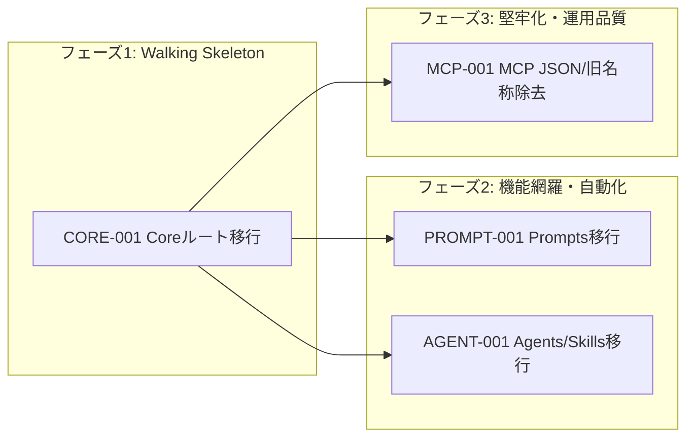

# 🧭 Copilot Workspace Manager GitHub Copilot CLI移植 実装計画

## 1. 🪜 フェーズ定義（MVP優先）

| フェーズ | 目的 | 完了条件（重要） | 代表的な成果物 |
| --- | --- | --- | --- |
| **フェーズ1: Walking Skeleton** | GitHub Copilot CLI の公式ルートとCore導線で拡張が起動できる | `COPILOT_HOME` / `~/.copilot` を検出し、Core Explorer が Copilot 設定・Instructions を表示する | Core path resolver、設定キー、Core Explorer |
| **フェーズ2: 機能網羅・自動化** | Explore / Manager / Sync の主要対象を Copilot CLI 向けファイルへ移行する | Prompts、Agents、Skills、MCP の対象パスとファイル形式が変更仕様に一致し、単体テストで検証される | Prompts/Agents/Skills/MCP の探索・作成・同期 |
| **フェーズ3: 堅牢化・運用品質** | 旧Codex名称・旧TOML前提を除去し、残存差異を防ぐ | `src` / package metadata に旧Codex前提の名称・文言・設定が残らず、型チェック・Lint・テストが成功する | 名称整理、ローカライズ、回帰テスト |

## 2. 🧾 Issueアウトライン

### IssueID: `CORE-001`

- タイトル: Copilot CLI Core ルートと設定導線へ移行する
- フェーズ: Walking Skeleton
- 要件: `specification-changes.md` の全体方針、Copilot Core Explore / Copilot Core View
- DependsOn: `なし`
- 規模: `0.5〜1日`
- 作業内容
  - `~/.codex` / `config.toml` 前提の resolver を `COPILOT_HOME` / `~/.copilot` / `config.json` 前提へ変更する
  - Core Explorer を `config.json`、`mcp-config.json`、`permissions-config.json`、instructions、logs、session-state、installed-plugins 表示へ変更する
  - 同期設定名とメニュー表示条件を `copilotFolder` へ移行し、Core同期を `.github/copilot-instructions.md` ↔ `~/.copilot/copilot-instructions.md` に固定する

- AC
  - [ ] [機能] `COPILOT_HOME` が設定されている場合、そのパスを Copilot CLI 設定ルートとして使う
  - [ ] [機能] `COPILOT_HOME` 未設定時は `~/.copilot` を設定ルートとして使う
  - [ ] [UI/UX] Core Explorer に Copilot Core の対象ファイル/フォルダだけが表示され、`config.toml` / `AGENTS.override.md` は表示されない
  - [ ] [状態/エラー] `config.json` が読めない場合は設定更新系だけを止め、Core の修復導線は残す
  - [ ] [テスト] path resolver、Core Explorer、Core同期の単体テストを更新する

### IssueID: `PROMPT-001`

- タイトル: Prompts Explore を CLI Commands / IDE Prompt Files へ移行する
- フェーズ: 機能網羅・自動化
- 要件: `specification-changes.md` の PROMPTS Explore / Prompts Manager View
- DependsOn: `CORE-001`
- 規模: `0.5〜1日`
- 作業内容
  - Prompts Explorer の表示対象を `.claude/commands/` と `.github/prompts/`、同期ライブラリ `.copilot/prompts/commands` / `.copilot/prompts/ide` に変更する
  - 新規ファイル作成時に CLI Command は `.md`、IDE Prompt は `.prompt.md` へ補正する
  - Prompts同期をカテゴリ選択なしの1対1固定同期に変更する

- AC
  - [ ] [機能] `.claude/commands/*.md` を CLI Command として表示できる
  - [ ] [機能] `.github/prompts/*.prompt.md` を IDE Prompt として表示できる
  - [ ] [UI/UX] 新規Prompt作成時に Workspace CLI Command / Workspace IDE Prompt を選択できる
  - [ ] [状態/エラー] `.copilot/prompts` は公式読込対象ではなく同期ライブラリとして扱う
  - [ ] [テスト] ファイル名補正と固定同期ペアの単体テストを追加する

### IssueID: `AGENT-001`

- タイトル: Agents / Skills を frontmatter ベースの Copilot仕様へ移行する
- フェーズ: 機能網羅・自動化
- 要件: `specification-changes.md` の Skills Explore、AGENTS Explore / AGENTS Manager View
- DependsOn: `CORE-001`
- 規模: `0.5〜1日`
- 作業内容
  - Agents探索・作成・Manager表示を `.github/agents/*.agent.md` / `~/.copilot/agents/*.agent.md` と YAML frontmatter へ変更する
  - `config.toml` の `[agents.<name>]`、`agents-disabled.json`、有効/無効トグルを廃止する
  - Skills探索・同期を `.github/skills/` ↔ `~/.copilot/skills/` に変更し、互換・Plugin Skill は表示対象のみとする

- AC
  - [ ] [機能] `.github/agents/*.agent.md` と `~/.copilot/agents/*.agent.md` を検出できる
  - [ ] [機能] Agent frontmatter の `name` / `description` / `model` / `tools` を Manager View に表示できる
  - [ ] [UI/UX] Agent追加時に `.agent.md` 拡張子へ補正し、ON/OFFトグルは表示されない
  - [ ] [状態/エラー] Plugin Agent / Plugin Skill は読み取り専用として扱う
  - [ ] [テスト] Agent/Skill location、作成、Manager表示、同期の単体テストを更新する

### IssueID: `MCP-001`

- タイトル: MCP JSON管理と旧Codex名称の除去を完了する
- フェーズ: 堅牢化・運用品質
- 要件: `specification-changes.md` の MCP Explore / MCP Manager View、制約事項
- DependsOn: `CORE-001`
- 規模: `0.5〜1日`
- 作業内容
  - MCP探索・Manager表示を `.github/mcp.json` / `~/.copilot/mcp-config.json` の JSON設定へ変更する
  - TOMLの `enabled` トグル、`enabled_tools` / `disabled_tools`、コメント保持パッチを廃止する
  - `src` / package metadata / ローカライズから旧Codex前提の名称・設定・文言を除去する

- AC
  - [ ] [機能] `.github/mcp.json` と `~/.copilot/mcp-config.json` から MCP server を読み取れる
  - [ ] [機能] `.mcp.json` は表示対象だが同期対象外として扱われる
  - [ ] [UI/UX] MCP Explorer に ON/OFF トグルは表示されない
  - [ ] [A11y/I18N] 日本語・英語の表示文言が Copilot CLI 前提へ更新される
  - [ ] [テスト] JSON MCP解析と旧名称残存チェックを単体テストで検証する

## 3. 🕸️ 依存関係マップ（Mermaid）

## 4. 📋 依存一覧（表）

| Issue | DependsOn | 並行可否メモ |
| --- | --- | --- |
| CORE-001 | なし | 最初に着手する。全機能のルート解決が依存する |
| PROMPT-001 | CORE-001 | Core resolver 確定後に着手 |
| AGENT-001 | CORE-001 | Core resolver 確定後に着手 |
| MCP-001 | CORE-001 | Core resolver 確定後に着手。最終名称整理を含むため最後に確認する |

## 5. ❓ 要確認事項

- なし。GitHub公式ドキュメントで `COPILOT_HOME`、custom agents、custom instructions、VS Code prompt files の基本パスを確認済み。
